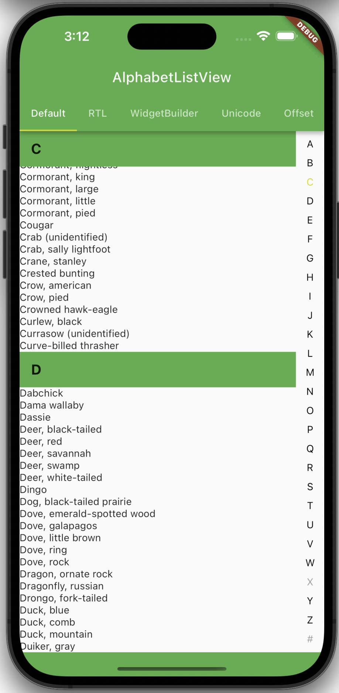
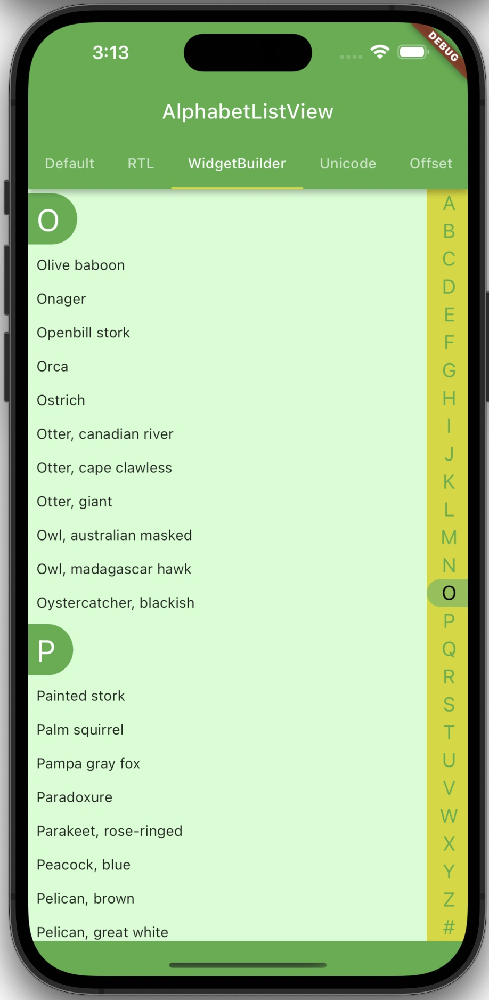
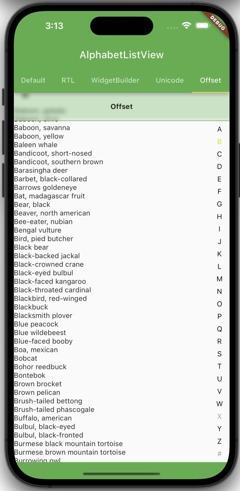
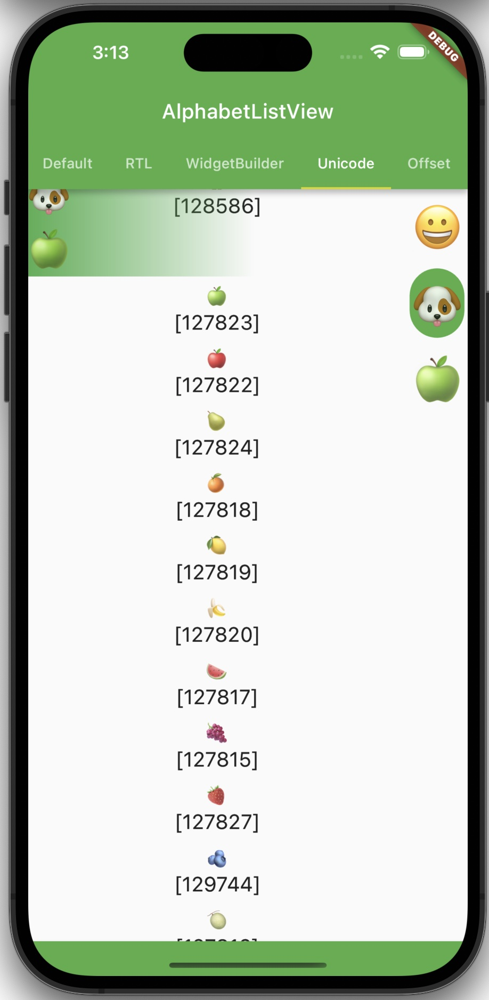
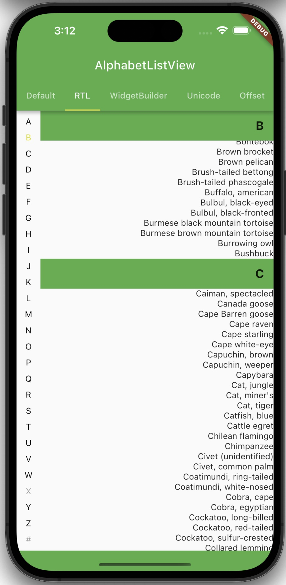

## Examples for the use of alphabet_list_view.

- ### Default ([Source](lib/pages/default.dart))
  

- ### RTL ([Source](lib/pages/rtl.dart))
  

- ### WidgetBuilder ([Source](lib/pages/widget_builder.dart))
  

- ### Unicode ([Source](lib/pages/unicode.dart))
  

- ### Offset ([Source](lib/pages/offset.dart))
  
